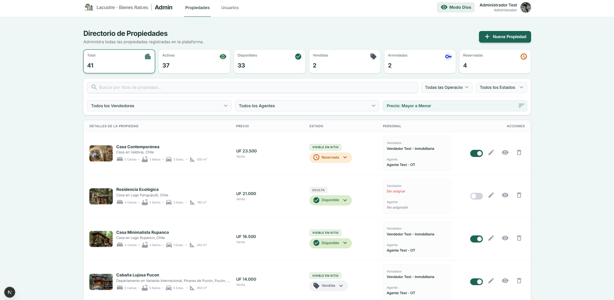

# Lacustre - Bienes Raíces
Plataforma de gestión y catálogo inmobiliario integral. Provee un entorno B2C para exploración de propiedades y un CRM multi-rol (B2B) para administración, agentes y vendedores.
---

## Descripción
Sistema inmobiliario fullstack desarrollado para gestionar el ciclo completo de bienes raíces. Permite a los usuarios finales explorar catálogos, guardar favoritos y agendar visitas, mientras provee paneles de control segregados para que vendedores y agentes gestionen sus portafolios de propiedades y leads. Todo el sistema está respaldado por arquitecturas serverless y control de acceso basado en roles (RBAC).

## Capturas de pantalla
*Pendiente de documentar. (Agrega aquí imágenes de la aplicación)*
<!-- Ejemplo de uso:


-->

## Características
* Catálogo público de propiedades con motor de búsqueda y filtros avanzados.
* Conversión dinámica de divisas (ej. Unidad de Fomento a Moneda Local) en tiempo real.
* Internacionalización (i18n) persistente mediante cookies.
* Autenticación híbrida: OAuth (Google, GitHub) y credenciales convencionales (Email/Password).
* Gestión de roles y permisos (Administrador, Agente, Vendedor, Usuario).
* Panel de control (CRM) para Administradores: gestión completa de catálogo, usuarios y asignaciones.
* Tableros independientes para Agentes y Vendedores orientados a la gestión de leads y agenda de visitas.
* Modales y flujos de interfaz con navegación suave (Soft Navigation) y degradación elegante.
* "Modo Dios" que permite a los administradores previsualizar interfaces de perfiles inferiores.

## Arquitectura
El proyecto utiliza una arquitectura Fullstack Serverless basada en componentes:
* **Frontend y Rutas:** Next.js (App Router) implementando Server Components para reducción de carga en cliente y Client Components estrictamente para interactividad (formularios, modales).
* **Backend y Persistencia:** Supabase (BaaS) encargado de la base de datos PostgreSQL, almacenamiento de objetos (Storage) y gestión de identidades (Auth).
* **Capa de Mutaciones:** Server Actions de Next.js actúan como reemplazo de los controladores REST tradicionales, gestionando mutaciones y revalidación de caché directamente desde la UI.
* **Seguridad (Capa Lógica):** Interceptores a nivel de `middleware` para validar tokens de sesión y autorizaciones antes del renderizado de rutas privadas.

## Tecnologías

| Tecnología | Versión | Uso |
| --- | --- | --- |
| Next.js | 16.2.6 | Framework Fullstack (App Router, Server Actions) |
| React | 19.2.4 | Librería de interfaz de usuario |
| TypeScript | 5.x | Tipado estático |
| TailwindCSS | 4.x | Sistema de diseño y utilidades CSS |
| Supabase (SSR/JS) | 0.12.0 / 2.108 | Base de datos (PostgreSQL), Auth y Storage |
| Leaflet | 1.9.4 | Renderizado de mapas interactivos |

## Requisitos
* Node.js v20 o superior
* npm v10 o superior
* Cuenta en Supabase con proyecto activo (PostgreSQL)

## Instalación

Clonar el repositorio:
```bash
git clone <url-del-repositorio>
cd bienes-raices
```

Instalar las dependencias del proyecto:
```bash
npm install
```

## Configuración
El proyecto requiere un archivo de variables de entorno para enlazarse con Supabase. Crea un archivo `.env.local` en la raíz del proyecto basándote en un modelo como `.env.example` y configura las siguientes variables (obtenidas desde los ajustes de la API en el panel de Supabase):

```env
NEXT_PUBLIC_SUPABASE_URL=https://<tu-id-de-proyecto>.supabase.co
NEXT_PUBLIC_SUPABASE_ANON_KEY=<tu-anon-key-publica>
```
*Importante: Los valores de producción deben inyectarse directamente en la plataforma de despliegue correspondiente.*

## Base de datos
El motor de base de datos es **PostgreSQL** gestionado mediante Supabase.
El esquema asume la existencia de las siguientes entidades principales (esquemas públicos):
* `user_profiles` (Extensión de datos de Auth)
* `user_roles` y `role_types` (Control de acceso RBAC)
* `properties`, `property_types`, `commercial_statuses` (Catálogo)
* `property_assignments` (Relación M:N entre propiedades y personal asignado)
* `favorites`, `visits` (Gestión de prospectos e interacción de usuarios)

## Ejecución

| Entorno | Comando |
| --- | --- |
| Desarrollo | `npm run dev` |
| Construcción | `npm run build` |
| Producción | `npm run start` |

## Scripts disponibles

| Script | Descripción |
| --- | --- |
| `dev` | Inicia el servidor de desarrollo de Next.js (Turbopack/Hot-reload) |
| `build` | Compila la aplicación para producción generando optimizaciones estáticas |
| `start` | Inicia el servidor de producción con los archivos pre-compilados |
| `lint` | Ejecuta ESLint para análisis de código estático y detección de errores |

## Estructura del proyecto
```text
├── app/
│   ├── admin/             # Módulo CRM para Administradores
│   ├── agente/            # Módulo de gestión para Agentes
│   ├── auth/              # Rutas de callbacks y callbacks de OAuth
│   ├── components/        # Componentes UI globales (Navbar, Footer, Cards)
│   ├── login/             # Interfaz de autenticación y registro
│   ├── properties/        # Vistas públicas de detalles de propiedades
│   └── vendedor/          # Módulo de gestión para Vendedores/Propietarios
├── lib/
│   ├── currency.ts        # Utilidades para formateo (UF / CLP)
│   ├── i18n.ts            # Lógica de internacionalización por cookies
│   └── supabase.ts        # Capa de abstracción de datos (Consultas y DTOs)
├── public/                # Recursos estáticos (imágenes, fuentes, iconos)
├── utils/                 # Utilidades de infraestructura
│   └── supabase/          # Clientes de inicialización de Supabase (Server, Client, Middleware)
├── middleware.ts          # Interceptor global para RBAC y protección de rutas
├── tailwind.css           # Punto de entrada de directivas de TailwindCSS
└── next.config.ts         # Configuración del servidor y optimización de imágenes (Remote Patterns)
```

## API
En lugar de una API REST convencional, el proyecto interactúa con el backend mediante dos canales directos:
1.  **PostgREST (SDK de Supabase):** Los Server Components leen datos directamente desde la base de datos invocando el cliente tipado de Supabase.
2.  **Server Actions (`actions.ts`):** Las escrituras (POST/PUT/DELETE) se ejecutan a través de funciones de servidor RPC (Remote Procedure Call) integradas en React. Retornan un formato de respuesta estándar: `{ error: string | null, data?: any }`.

## Flujo de la aplicación
1. Los visitantes sin autenticación acceden a las vistas estáticas y de listado (página de inicio, catálogo de propiedades).
2. Para acceder a funcionalidades interactivas (Favoritos, Visitas), el usuario debe crear cuenta o iniciar sesión.
3. El `middleware.ts` intercepta la navegación hacia directorios protegidos (`/admin`, `/agente`, `/vendedor`) consultando el rol del usuario en la tabla `user_roles`.
4. Si el acceso es autorizado, los Server Components de la vista recuperan los datos correspondientes en SSR basándose en el ID de usuario activo (`auth.getUser()`), aislando la visibilidad de datos mediante políticas en la base de datos.

## Seguridad
*   **Autenticación:** Gestionada íntegramente por Supabase Auth. Las credenciales nunca tocan lógicas propias del servidor de Next.js.
*   **Sesiones:** Administradas por SSR Cookies securizadas que previenen accesos no autorizados. 
*   **Autorización Backend (RLS):** Las tablas en PostgreSQL cuentan con Row Level Security habilitado. Un Agente o Vendedor no puede visualizar datos ni manipular entidades (aunque intercepte el endpoint) sin coincidir con los permisos exactos evaluados a nivel motor de BD.
*   **Autorización Frontend:** Protección de sub-rutas mediante validación estricta de estado en `middleware.ts` para prevención de redireccionamientos cíclicos.
*   **Sanitización de Datos:** Patrones estrictos (Regex) impuestos tanto en frontend como en el nivel de validación de Server Actions.

## Estado del proyecto
El proyecto se encuentra en etapa de **MVP en escalamiento de funcionalidades**, preparado para entornos de producción iniciales y retroalimentación de usuarios beta.
